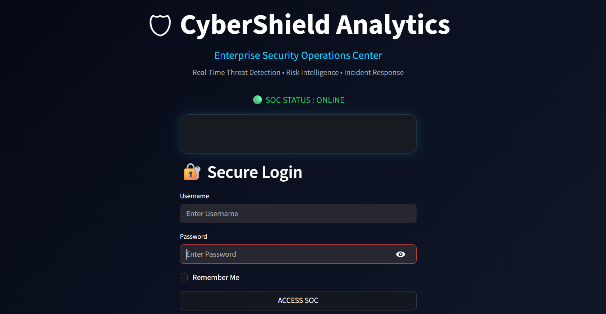
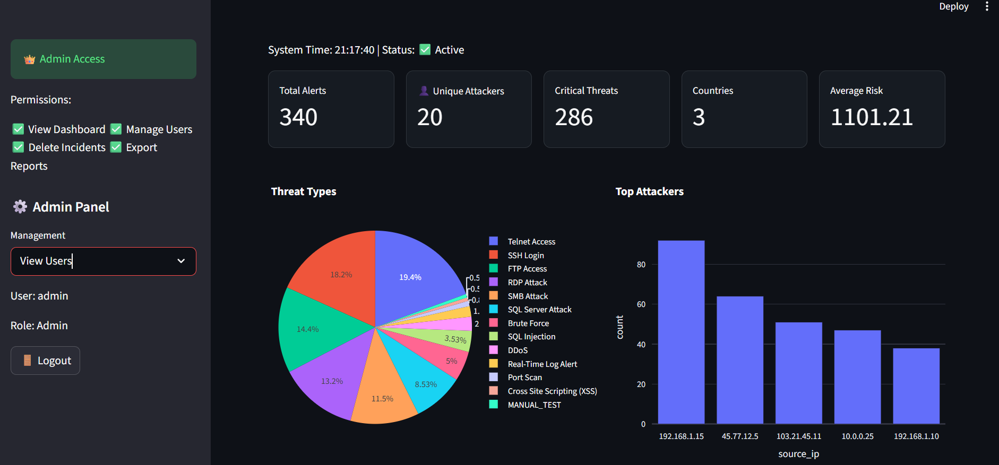
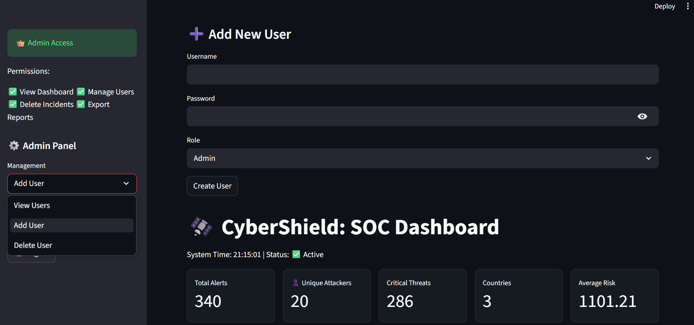
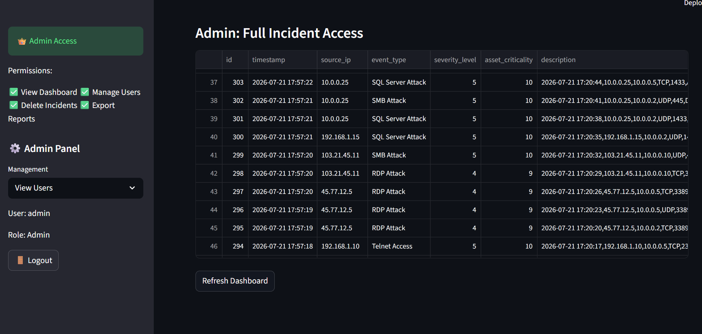

# 🛡 CyberShield Analytics
## Enterprise Security Operations Center (SOC) Platform
CyberShield Analytics is an enterprise-style Security Operations Center (SOC) platform developed using Python, MySQL, and Streamlit.
The platform continuously monitors system logs and simulated network traffic, identifies malicious activities using a rule-based detection engine, calculates dynamic risk scores, stores threat intelligence in a MySQL database, and visualizes incidents through an interactive SOC dashboard.

This project demonstrates practical cybersecurity analytics, automation, database management, dashboard development, authentication, and incident management within a single application.


## Table of Contents
- [Login_Page](#login-page)
- [Project Structure](#-project-structure)
- [Project Overview](#project-overview)
- [Business Problem](#business-problem)
- [Soc_Dashboard](#-soc-dashboard)
- [Project Objectives](#project-objectives)
- [Key Features](#key-features)
- [Technology Stack](#technology-stack)
- [Dashboard Preview](#-dashboard-preview)
- [Database Structure](#database-structure)
- [Authentication Workflow](#authentication-workflow)
- [How_to_Run_System](#how-to-run-system)
- [Incidents_Logs_Dashboard](#-incidents-logs-dashboard)
- [Project Outcomes](#project-outcomes)
- [Future Enhancements](#future-enhancements)
- [Author](#author)


### Login page



## 📂 Project Structure
```
├── Alert_Notification_Showcase/
│   └── alert_notification
│
├── Cyber_Shield_Report/
│   └── CyberShield_Analytics_Project_Report
│
├── DB_creation_for_storing_live_incidents/
│   └── data_stored_in_mysql_database
│
├── Log_Files/
│   ├── network_traffic
│   └── server_access
│
├── Python/
│   ├── hash_password.py
│   ├── ip_intelligence.py
│   ├── network_detector.py
│   ├── test_incident.py
│   ├── test_ip.py
│   ├── alert_engine.py
│   ├── login.py
│   ├── user_management.py
│   ├── monitor.py
│   ├── detector.py
│   ├── network_monitor.py
│   ├── traffic_generator.py
│   ├── incident_manager.py
│   ├── database.py
│   ├── config.py
│   └── windows_detector
│
├── Sql/
│   ├── database.sql
│   └── sample_data.sql
│
├── Streamlit_Dashboard/
│   ├── Dashboard1
│   ├── Dashboard_2
│   ├── Dashboard_3
│   └── login_page
│
└── README.md/
```

##  Project Overview 

Organizations generate thousands of security logs every day from servers, applications, firewalls, and network devices.

CyberShield Analytics automates the Security Operations Center (SOC) workflow by monitoring logs in real time, detecting cyber attacks, calculating risk scores, storing incidents in MySQL, and visualizing security metrics through a Streamlit dashboard.

This project demonstrates practical implementation of:

- Cybersecurity Analytics
- Log Monitoring
- Threat Detection
- Incident Management
- Risk Assessment
- Database Management
- Dashboard Development
- Role-Based Authentication


## Business Problem
Organizations receive thousands of security events every day from servers, applications, firewalls, and network devices. Manually reviewing these logs is time-consuming and often results in delayed responses to cyber threats.

Security teams require an automated platform that can:

- Monitor incoming logs continuously
- Detect suspicious activities automatically
- Prioritize threats based on risk
- Alert analysts quickly
- Track incidents until resolution
- Visualize security metrics through dashboards

CyberShield Analytics addresses these challenges by providing a simplified yet enterprise-inspired Security Operations Center (SOC) workflow.


## 📊 Soc Dashboard



## Project Objectives

- Build a real-time SOC monitoring platform
- Detect common cyber attacks automatically
- Calculate dynamic risk scores
- Store threats in a centralized MySQL database
- Create interactive dashboards
- Implement secure login with role-based access
- Manage incidents through their lifecycle
- Demonstrate enterprise SOC architecture

##  Key Features

### ✅ Real-Time Log Monitoring
The platform continuously monitors log files using Python Watchdog.

Example log:

```text
192.168.1.100, FAILED
```

Detection:

```text
Brute Force Attack Detected
```


### ✅ Supported Threat Detection

| Threat | Detection Pattern |
|---------|------------------|
| Brute Force | FAILED |
| SQL Injection | UNION SELECT |
| Cross-Site Scripting (XSS) | `<script>` |
| Port Scan | Nmap |
| SSH Attack | Port 22 |
| FTP Attack | Port 21 |
| Telnet Attack | Port 23 |
| SMB Attack | Port 445 |
| RDP Attack | Port 3389 |
| SQL Server Attack | Port 1433 |


### ✅ Dynamic Risk Scoring

CyberShield calculates risk dynamically using:

Risk Score = Severity × Asset Criticality × Frequency

Example:

| Parameter | Value |
|-----------|------:|
| Severity | 5 |
| Asset Criticality | 10 |
| Frequency | 6 |

Risk Score = **300**

Higher scores indicate higher priority incidents.


### 🌐 Network Traffic Monitoring

The platform simulates enterprise network traffic.

Example:

```text
Source IP : 192.168.1.15
Destination : 10.0.0.10
Protocol : TCP
Port : 3389
Action : DENY
```

Detected Threat

```text
Remote Desktop Protocol (RDP) Attack
```


### ✅ IP Intelligence

Each detected IP is enriched with:

- Country
- City
- ISP
- Organization
- Risk Score


### ✅ Incident Management

Critical threats automatically generate incidents.

Incident Workflow

```
OPEN
   ↓
INVESTIGATING
   ↓
RESOLVED
```


## 📊 Dashboard Preview


##  Role-Based Authentication

Passwords are securely hashed using bcrypt.

| Role | Permissions |
|------|-------------|
| Admin | Full Access |
| SOC Analyst | Investigate Incidents |
| Viewer | Read-only Dashboard |


## Technology Stack

- Programming Language -> Python 3.12
- Dashboard -> Streamlit
- Database -> MySQL
- Data Processing -> Pandas
- Visualization -> Plotly
- Authentication -> bcrypt
- Log Monitoring -> Watchdog
- Database Connector -> mysql-connector-python
- Version Control -> Git & GitHub


## Enterprise Architecture

```
               System Logs
                    │
                    ▼
        Watchdog File Monitor
                    │
                    ▼
       Threat Detection Engine
                    │
       ┌────────────┴────────────┐
       ▼                         ▼
Risk Score Engine        Incident Manager
       │                         │
       └────────────┬────────────┘
                    ▼
             MySQL Database
                    │
       ┌────────────┴────────────┐
       ▼                         ▼
 Streamlit Dashboard      Alert Engine
                    │
                    ▼
               SOC Analyst
```


## Database Structure
**The application contains three primary tables.**
### ThreatLogs
Stores ThreatLogs information.

**Columns**

          - id
          - source_ip
          - event_type
          - severity_level
          - asset_criticality
          - description
          - frequency
          - risk_score
          - country
          - city
          - isp
          - organization
          - created_at

### Users
Stores authentication information.

**Columns**

          - user_id
          - username
          - password
          - role

### Incidents
Tracks incident lifecycle.

**Columns**

          - incident_id
          - threat_id
          - source_ip
          - attack_type
          - severity
          - risk_score
          - status
          - risk_score
          - assigned_to
          - created_time
          - resolved_time


## Authentication Workflow

```
User Login
     │
     ▼
Enter Credentials
     │
     ▼
Fetch User from MySQL
     │
     ▼
Verify Password (bcrypt)
     │
     ▼
Authentication Successful?
      │
 ┌────┴────┐
 ▼         ▼
Dashboard  Login Failed
```


## How to Run System
### Start Log Monitor

```bash
python monitor.py
```

### Start Network Monitor

```bash
python network_monitor.py
```

### Launch Dashboard

```bash
streamlit run app.py
```

### Open:

```
http://localhost:8501
```


## 📊 Incidents logs Dashboard



## Project Outcomes

CyberShield Analytics successfully demonstrates:

- Automated Threat Detection
- Real-Time Log Monitoring
- Network Traffic Monitoring
- Dynamic Risk Scoring
- Incident Management
- MySQL Integration
- Interactive Dashboards
- Role-Based Authentication
- Cybersecurity Analytics


## Future Enhancements

- Machine Learning Threat Detection
- Behavioral Analytics
- Insider Threat Detection
- VirusTotal Integration
- AbuseIPDB Integration
- Email Alerts
- Slack Notifications
- Real Packet Capture (Scapy)
- SIEM Integration


## Author
**Prajakta Bhondave**

**Aspiring Data Analyst | Python | SQL | Power BI | Streamlit | Cybersecurity Analytics**

- **GitHub:** https://github.com/prajakta-89
- **LinkedIn:** https://www.linkedin.com/in/prajakta-bhondave-773b092a6
